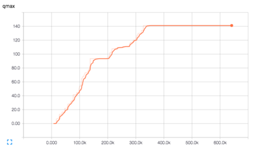
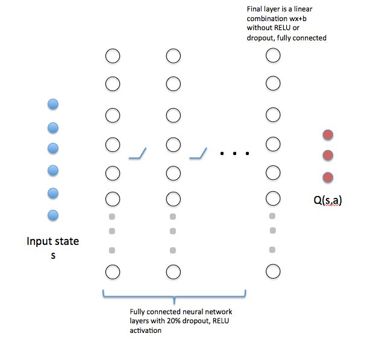

# PacFlow
## Pedagogical Autonomous Cars with TensorFlow

This project was submitted in partial fulfillment
of the Udacity Machine Learning Engineer Nanodegree.

Scott Penberthy  
November 1, 2016

_[Ed. This is a work in progress, publishing by the end of October if I'm lucky!]_

## I. Definition

### Project Overview
Self-driving cars are fascinating.  However, the learning curve is steep.  We noticed a lack of simple environments
for experimenting with the underlying algorithms in pedagogical settings.  We have built one such environment here, which a programmer can run just fine _without_ expensive GPUs.  

Our virtual environment is a derivative of 
[Matt Harvey's virtual car](https://medium.com/@harvitronix/using-reinforcement-learning-in-python-to-teach-a-virtual-car-to-avoid-obstacles-6e782cc7d4c6#.58wi2s7ct), 
ported to work with TensorFlow, Python 2.7, and PyGame 5.0. The
machine learning algorithm is based on 
[Deep Q Reinforcement Learning](http://home.uchicago.edu/~arij/journalclub/papers/2015_Mnih_et_al.pdf), 
without the "deep" part.  Many of the ideas
were derived from [songotrek's Tensorflow implementation](https://github.com/songrotek/DQN-Atari-Tensorflow/blob/master/BrainDQN_Nature.py) of DeepMind's
[Atari-playing Deep Q Learner](http://home.uchicago.edu/~arij/journalclub/papers/2015_Mnih_et_al.pdf)


### Problem Statement


Your job is to write an AI for a simulated toy car that learns to drive by itself.  

The figure above captures our toy car scenario.  The car is shown in green, sensing the environment
via three sonar sensors. Three slow-moving obstacles are shown in blue.  A cat darts around the
environment in orange.   Our challenge is to build a learning algorithm that learns to drive
without hitting things.  The car's throttle is stuck in the "on" position.  Hey, its a cheap toy.

### Prerequisites
1. [Anaconda Python Distribution, 2.7](https://www.continuum.io/why-anaconda) for Python
2. [Tensorflow for Anaconda](https://www.tensorflow.org/versions/r0.11/get_started/os_setup.html#anaconda-installation) for AI
3. [PyGame](http://www.pygame.org/wiki/GettingStarted) for graphics
4. [PyMunk](http://www.pymunk.org/en/latest/) for physics
5. [Numpy](http://www.numpy.org/) for math

This has been successfully tested on a MacBook Pro running OS X El Capitan.

### Running the code
After successfully cloning this repository and installing all the prerequisites, ```cd``` to
the repository directory so we have access to ```learning.py``` and ```carmunk.py```.  Let's activate
the TensorFlow environment and launch an interactive python shell:

```
% source activate tensorflow
(tensorflow) % ipython
Python 2.7.12 |Continuum Analytics, Inc.| (default, Jul  2 2016, 17:43:17) 
Type "copyright", "credits" or "license" for more information.

IPython 5.1.0 -- An enhanced Interactive Python.
?         -> Introduction and overview of IPython's features.
%quickref -> Quick reference.
help      -> Python's own help system.
object?   -> Details about 'object', use 'object??' for extra details.

In [1]: 
```

Next, let's import our file then create our Deep Q learner environment in 
one line of code!
```python
In [1]: from learning import *

In [2]: ai = Learner()
```

_[ed. At the time of this writing, you may see warning statements on a Mac about using outdated audio controls.  That's OK.  We don't
need audio for this task.]_

The ```ai``` object is our Deep Q Learner, without the deep, controlling a simluated game ```g```
analyzed by a Tensorflow session ```s```.  Let's get into it.  Try the following to demo 1000 steps of
the simulator and watch the car drive!  At this point the algorithm is purely random.

```python
In [3]: ai.demo()
```
You can try each step yourself, going straight, left or right.  You'll see three items returned,
the reward, an array of sensor readings, and a boolean indicating whether you've hit a wall
or object:

```python
In [4]: ai.g.step(0)
(-2.0, array([ 6.        ,  4.        ,  6.        ,  0.13147931,  0.16259441,
         4.68615124]), False)

In [5]: ai.g.step(1)
(-2.0, array([ 4.        ,  4.        ,  6.        ,  0.12923619,  0.14867274,
         4.48615124]), False)


In [6]: ai.g.step(2)
(-3.0, array([ 5.        ,  3.        ,  5.        ,  0.12897384,  0.13439194,
         4.68615124]), False)
```


### Metrics


We will evaluate our algorithm by comparing its top score performance in
1000 games against an agent that picks actions randomly.  That's all that 
matters in the end -- bragging rights for the most number of iterations
before a crash.  We need to do (much) better than random chance.

We will track learning progress with "Q Max" from the Deep Q Learning paper, as seen above. Qmax is essentially
a measure of agent confidence.  As the agent learns, its better able to predict what action to take, leading to
higher rewards.  The "Q" value tells the agent how much it believes a given state is worth in terms of 
longterm reward.  The longer the agent stays alive, the greater the reward, the higher QMax. Technically, Qmax 
is the maximum value seen by the neural network that's learning to estimate the Q function,
across all training examples, across time.

We'll use the TensorBoard visualizer available with Tensorflow to see our top score and QMax change over time.
Our learning agent sits and observes for several thousand iterations before learning.  Like Mom taught us, 
it pays to listen and observe before making judgment!

Tensorboard runs as a local Java application, serving web pages as its GUI on a local port.  This is Google, after all.
The visualizer reads log data from the "train" subdirectory and periodically updates the display as log data
grows.  I find that periodically cleaning this directory is quite useful.

To see this work, let's mute the graphic display and run 25,000 iterations:
```python
In [7]: ai.mute()
True

In [8]: for i in range(25000): ai.step()
```
Now launch another terminal and ```cd``` to the repository directory, activating tensorflow
as before.  You'll see new content in the
log directory.  Your log filename will be different than mine, a combo of time and your local machine
name.  Launch tensorboard and point to this directory.
```
% source activate tensorflow

(tensorflow) % ls train
events.out.tfevents.1476194157.Scotts-MBP.home 

(tensorflow) % tensorboard --logdir train
Starting TensorBoard 23 on port 6006
(You can navigate to http://0.0.0.0:6006)
```
Launch your browser and navigate to http://0.0.00:6006.  You'll see three numbers we're tracking, loss, qmax and
score. Loss represents the amount of error in a random sample of historical frames, taken every learning
cycle.  QMax and Score are tracked over time, too.  Click to reveal or hide plots.

If you're curious, click on the "histograms" tab to see our network weights and biases change over time
as shown below. "q_train" refers to the training network that feeds on the memory of the last
32,000 events.  A "bn" metric represents the bias values with "wN" weights value in neural network
that computes yN = wN*x + bN.  

Here's how to read the chart.  

Each vertical slice in time is a modified statistical box plot, which
shows the first and second standard deviations as a band of dark (1) and lighter (2) orange,
with a faded orange for outliers.  When we plot these bands closely together
and connect the regions, we get a flowing orange shape showing our distribution "on the side" as the
statistical mean shifts over time. 


## II. Analysis

### Data Exploration
The simulator provides the following information about the car at every cycle:
- s1, s2, s3 - 3 sensor readings from 0-40
- x - x position, [0,1] where 0 is far left, 1 far right
- y - y position, [0,1] where 0 is top, 1 bottom
- theta - the heading angle of the car, 0 to 2*pi

You're allowed to take three actions:
- 0, stay on course
- 1, turn left by 0.2 radians
- 2, turn right by 0.2 radians

In addition to the sensor readings, the simulator also returns the following at
each iteration:
- Reward, an integer in [-100, 10] where negative values are bad, positive values are good
- Terminal, a boolean indicating whether a crash has occurred

Our challenge is to choose an action (0,1 or 2) at each time step.  We're only given the state (s1,s2,s3,x,y,theta), 
a prior reward, and a boolean.  

When we're driving free and clear, the reward varies over
the interval [-4, 34] which represents the shortest distance recorded by a sonar sensor
offset by -6.  Thus, if one
sensor has a reading of 2, the reward will be -4.  

A crash occurs when a sensor reading of 1 senses an object, returning a reward of -100.  The simulator randomly shifts
and rotates the car in an attempt to "get free" from the obstacle. Think of this as an amygdala-driven safety
reaction to danger, like a cat springing into the air at the sight of a cucumber.


The x and y position are floating point numbers varying from 0 to 1, indicating how far along each axis we sit.  The
angle is measured in radians, varying from 0 to 2*Pi.  These measurements are a replacement for "SLAM" technology
that simultaneously creates maps of the environment from richer sensor data.  The hope here is that the learning
algorithm figures out to stay closer to the middle, to turn away from walls, and to avoid objects when they're 
getting close.

### Exploratory Visualization


Here we see an animation of the environment where actions are chosen
at random.  The green car moves and not that well.  Each time it collides with
an object, wall, or cat, the screen blinks red.  The sensors are shown as
white dots eminating from the car.  These are the lines used to detect
the distance to objects.

We can see this in slow motion, too, controlling updates with our mouse
movement and 
terminating with control-C.  We flip the mute switch until it returns
False, meaning that the display will be active.  We call the ```explore```
method of our learning agent.  Each mouse or keyboard action
advances the play, printing out the current time step, the six
state values [s1, s2, s3, x, y, theta] and the reward R.  While
the visual animation is easier to understand, the numbers
give us a sense of the actual input to the learning algorithm.
```
In [8]: ai.mute()
Out[8]: True

In [9]: ai.mute()
Out[9]: False

In [10]: ai.explore()
11 [0.1, 0.675, 0.375, 0.19214722317827213, 0.2243449725383465, 0.14323944878270578] R= -3.0
12 [0.075, 0.825, 0.375, 0.19979564505111702, 0.2335480823560278, 0.11140846016432673] R= -2.0
13 [0.1, 0.9, 0.675, 0.20857147067002074, 0.24039701862180216, 0.07957747154594766] R= -3.0
14 [0.075, 0.8, 0.35, 0.21621989254286564, 0.24960012843948348, 0.11140846016432673] R= -2.0
15 [0.1, 0.875, 0.7, 0.2249957181617694, 0.2564490647052578, 0.07957747154594766] R= 10.0
16 [0.575, 0.4, 0.4, 0.23454908305302546, 0.260670781943277, 0.04774648292756859] R= 6.0
^C
KeyboardInterrupt:

In [11]: 
```

### Algorithms and Techniques


This toy car scenario can be formalized by the diagram above.  We have an agent, the car, at the top of the diagram.  At a point
in time t we must choose an action a_t.  This agent interacts with environment, causing the state of the
environment s_t+1 to change in the next time step t+1.  In addition the agent receives a perceived reward r_t.  The agent
then considers the tuple (s_t, a_t, s_t+1, r_t) and decides upon the next action a_t+1.  This repeats ad nauseum.

The machine learning literature calls this a _reinforcement learning_ problem.  Each action is "reinforced" through positive
or negative "reward", getting us closer or farther away from a desired "state."  Let's define a function Q(s_t,a_t) as
the expected, cumulative reward of taking action a_t in state s_t.  How might we calculate this magical function Q?

We can define this recursively as a dynamic programming problem.  Q(s_t,a_t) becomes the reward r_t we receive 
for taking action a_t, plus the _best_ cumulative reward available in the new state s_t+1.  The best reward is then
the maximum Q(s_t+1,a_t+1) available in s_t+1.  The best action to take in a state is always the action a_t that
has the highest Q value.  This leads to the insightful, recursive Bellman equation:


Bellman defines a learning parameter, gamma, that tells us how much of our previous estimate of q(s,a)
we want to believe when updating values (from 0-100% or 0.0-1.0).  We want to learn slowly and deliberately, ironing out statistical
outliers.  Gamma is often quite close to 1.0, or 0.9 in our case.

This seems easy enough, but how do we pick initial Q values?  What's interesting is that, over infinite time, it doesn't
really matter!  With infinite iterations of this algorithm the values of Q(s,t) will settle to an optimal plan.  Common
practice starts with something reasonable, namely some white Gaussian noise around 0.

Many implementations keep track of a "Q state table" which we update every cycle based on actions and observations.  This
is fine for simple puzzles and games, but it quickly falls apart for domains with very large state sets.  The toy car example
uses floating point numbers for the sensors, position and angle, and has an infinite state space.

We replace the state table with a neural network shown below.  We use the existing state s_t as the input values.  These are then
fed through multiple hidden layers with nonlinear activation and dropout, followed by a final linear combination
layer.  The output layer corresponds to a single neuron for each potential action, which
in this case yields 3 nodes. 



In our code, the number of nodes in each hidden layer are kept in an
array ```n_hidden```.  For example the code below specifies a network with a first layer of 64 neurons, 
followed by 3 layers of 128 nodes each, then a final linear layer of 64 nodes:

```python
In [10]:  n_hidden =[64] + [128]*3 + [64]
```

The neural network "learns" the Q state table by solving a non-linear regression, mapping an input state s
to the numerical values for Q(s,a_i) for all actions a_i.  For our scenario, we have 6 input variables and 3 output
variables.  Keeping in line with
earlier observations about Q(s,t), we initialize
the network with white noise.  The weights are Gaussian noise about 0, with a standard deviation of 0.01.  The biases
are all positive, again at 0.01, shifting the solution space slightly away from 0.

That's fine, but how what do we "train" this network?  Isn't that supervised learning, where we want the ultimate
solution?

This is the ingenius trick of the Deep Q Learning crowd.  They use _two_ copies of the neural network, one to train, and
another to calculate the Q(s_t+1, a_t+1) "target" values.  The "training" network feeds not on the current actions, but on
a sample of recent history called a "minibatch."  We calculate the maximum Q(s,t) values of the minibatch, then use
this as the target value when adjusting weights in the training network (via gradient descent, minimizing the squared error
between our predicted Q values and the target Q values).  We repeat until we've completely refreshed
the recent history.  At that point in time we copy all the weights from the training network to the active, target network
and repeat.

The target network drives actions in the simulator and updates the recent history.  We keep
the training network "offline" to prevent thrashing. If you look carefully at our QMax values from before, you'll notice a staircase effect as the values climb over time.  Each step up occurs when the smarter training network 
is copied to the target network.  Neat, huh?


### Benchmark

We want to ensure that our algorithm is doing better than random chance.  We seed all
the random generators to 0, then evaluate the agent by playing 1000 consecutive games.  The score of
a game is defined by 
the number of frames before a crash occurs, at which point a game ends.  The car recovers like a cat
jumping from a cucumber, then the next game begins.  We report basic statistics on the scores from
the 1000 games. The score to beat is 192.

|  Agent           | Top Score | Mean   | Stdev  | Low   |
| ---------------- | --------: | -----: | -----: | -----:|
| Random           | 192       | 27.6   | 23.7   |   1.0 |


## III. Methodology

### Data Preprocessing

We normalize input parameters so they all fall between 0 and 1.  This prevents 
bias towards parameters with larger absolute values.  

The x,y positions are left unchanged.  The angle theta is
modulated by 2 Pi, then scaled by 1/(2 Pi).  In earlier versions of the code we found that
the angle would increase into the thousands of radians, sending our network into a tailspin
as biases would shift.  The modolu fixed that.  Sensor readings are scaled by 1/40.

We explored scaling the rewards similarly, between -1.0 and 1.0.  This was done in the original deep Q learning
paper so that various atari games were treated similarly.  Perhaps it was impatience, but we found
that the network continued to explore and fail to learn much in the first million iterations.  The higher
reward values made learning easier, as the reward "signal" stood out from the Gaussian noise embedded within
the network.  With a smaller reward values, the Gaussian noise hid the signal and the network floundered.

### Implementation

Our implementation consists of two files.  

```carmunk.py``` is a port of the original CarMunk car driving
game so that it works properly with PyMunk 5.0 and Python 2.7.  We changed the negative reward for a crash
from -500 to -100, then adding some basic functionality for tracking performance and debugging.

```learning.py``` is an implementation of Deep Q reinforcement learning using local Tensorflow
for computing feed-forward values and adjusting weights via back propagation.  We say "without the deep," as our network
is a simple, fully-connected network versus their deep convolutional network with hundreds of layers.  
We are not operating from pixels.  We focus on a simpler, pedagogical problem of three sensors
and simple game physics.

Tensorflow has a python front-end where you first define all the input
variables, the networks, and the output variables.  This forms a data pipeline, much like the graphics
pipelines common in videogames.  When you "run" a network forward, Tensorflow interacts with
a fast implementation in C and C++ and returns the values to Python.  This scales to larger networks by running
that same code in a distributed manner, where the intense computations can be run in the cloud, or soon
in the cloud with hardware acceleration via TPUs and GPUs.  When we "run" the backpropagation backward, Tensorflow
performs the matrix determinants and multiplications with the C and C++ code, adjusting weights and returning values.

Tensorboard is a visualizer for variables, weights, biases and more.  You'll see a rather peculiar trick, where we stuff the values
for our maximum Q value and maximum Score from Python into Tensorflow on every iteration.  Tensorboard can only
report on values stored in the C/C++ pipeline.  This took me a bit of time to figure out.

### Refinement
In this section, you will need to discuss the process of improvement you made upon the algorithms and techniques you used in your implementation. For example, adjusting parameters for certain models to acquire improved solutions would fall under the refinement category. Your initial and final solutions should be reported, as well as any significant intermediate results as necessary. Questions to ask yourself when writing this section:
- _Has an initial solution been found and clearly reported?_
- _Is the process of improvement clearly documented, such as what techniques were used?_
- _Are intermediate and final solutions clearly reported as the process is improved?_


## IV. Results
_(approx. 2-3 pages)_

### Model Evaluation and Validation
In this section, the final model and any supporting qualities should be evaluated in detail. It should be clear how the final model was derived and why this model was chosen. In addition, some type of analysis should be used to validate the robustness of this model and its solution, such as manipulating the input data or environment to see how the model’s solution is affected (this is called sensitivity analysis). Questions to ask yourself when writing this section:
- _Is the final model reasonable and aligning with solution expectations? Are the final parameters of the model appropriate?_
- _Has the final model been tested with various inputs to evaluate whether the model generalizes well to unseen data?_
- _Is the model robust enough for the problem? Do small perturbations (changes) in training data or the input space greatly affect the results?_
- _Can results found from the model be trusted?_

### Justification
In this section, your model’s final solution and its results should be compared to the benchmark you established earlier in the project using some type of statistical analysis. You should also justify whether these results and the solution are significant enough to have solved the problem posed in the project. Questions to ask yourself when writing this section:
- _Are the final results found stronger than the benchmark result reported earlier?_
- _Have you thoroughly analyzed and discussed the final solution?_
- _Is the final solution significant enough to have solved the problem?_


## V. Conclusion
_(approx. 1-2 pages)_

### Free-Form Visualization
In this section, you will need to provide some form of visualization that emphasizes an important quality about the project. It is much more free-form, but should reasonably support a significant result or characteristic about the problem that you want to discuss. Questions to ask yourself when writing this section:
- _Have you visualized a relevant or important quality about the problem, dataset, input data, or results?_
- _Is the visualization thoroughly analyzed and discussed?_
- _If a plot is provided, are the axes, title, and datum clearly defined?_

### Reflection
In this section, you will summarize the entire end-to-end problem solution and discuss one or two particular aspects of the project you found interesting or difficult. You are expected to reflect on the project as a whole to show that you have a firm understanding of the entire process employed in your work. Questions to ask yourself when writing this section:
- _Have you thoroughly summarized the entire process you used for this project?_
- _Were there any interesting aspects of the project?_
- _Were there any difficult aspects of the project?_
- _Does the final model and solution fit your expectations for the problem, and should it be used in a general setting to solve these types of problems?_

### Improvement
In this section, you will need to provide discussion as to how one aspect of the implementation you designed could be improved. As an example, consider ways your implementation can be made more general, and what would need to be modified. You do not need to make this improvement, but the potential solutions resulting from these changes are considered and compared/contrasted to your current solution. Questions to ask yourself when writing this section:
- _Are there further improvements that could be made on the algorithms or techniques you used in this project?_
- _Were there algorithms or techniques you researched that you did not know how to implement, but would consider using if you knew how?_
- _If you used your final solution as the new benchmark, do you think an even better solution exists?_

-----------

**Before submitting, ask yourself. . .**

- Does the project report you’ve written follow a well-organized structure similar to that of the project template?
- Is each section (particularly **Analysis** and **Methodology**) written in a clear, concise and specific fashion? Are there any ambiguous terms or phrases that need clarification?
- Would the intended audience of your project be able to understand your analysis, methods, and results?
- Have you properly proof-read your project report to assure there are minimal grammatical and spelling mistakes?
- Are all the resources used for this project correctly cited and referenced?
- Is the code that implements your solution easily readable and properly commented?
- Does the code execute without error and produce results similar to those reported?
